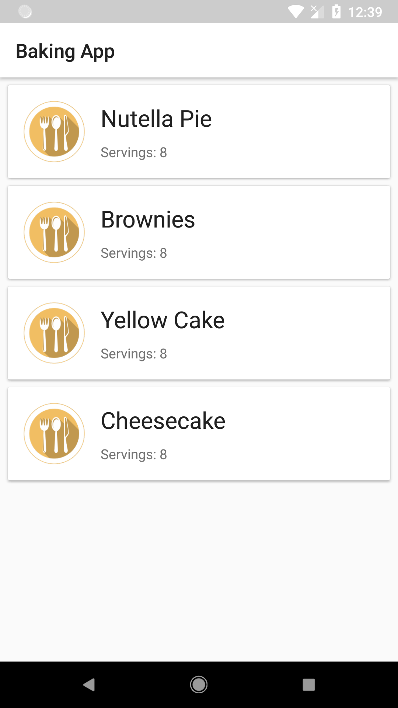
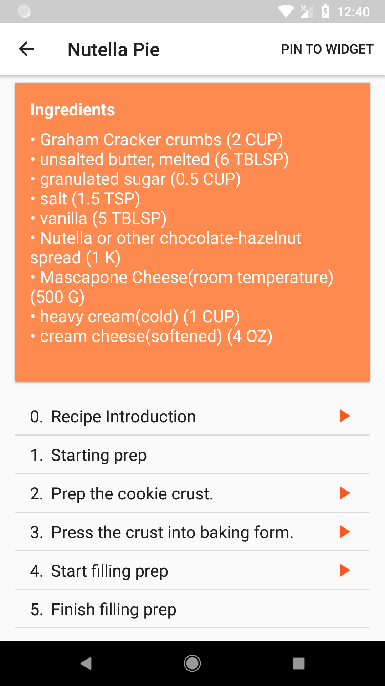
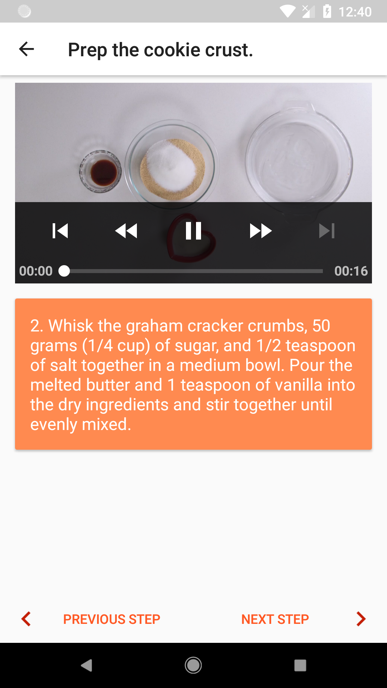
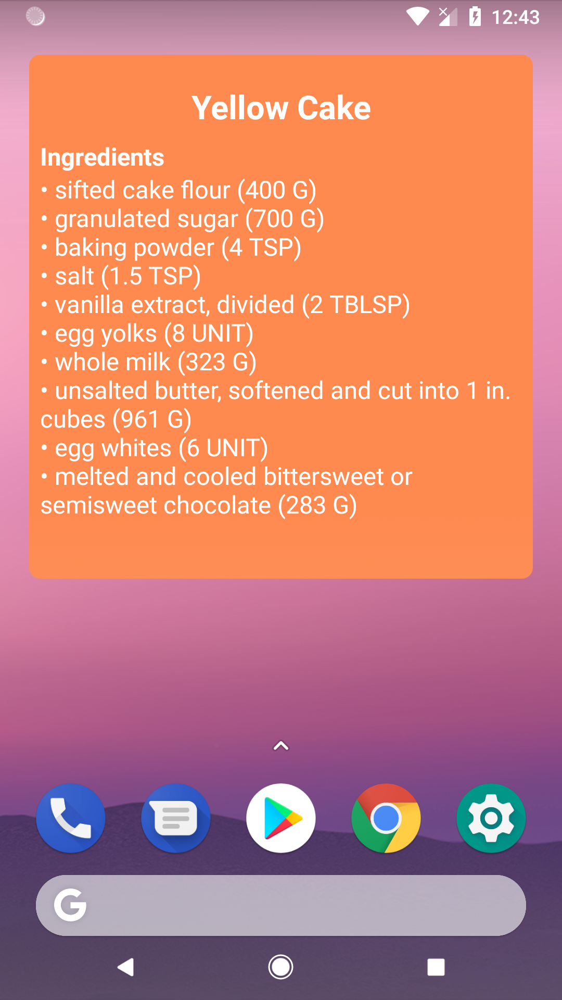
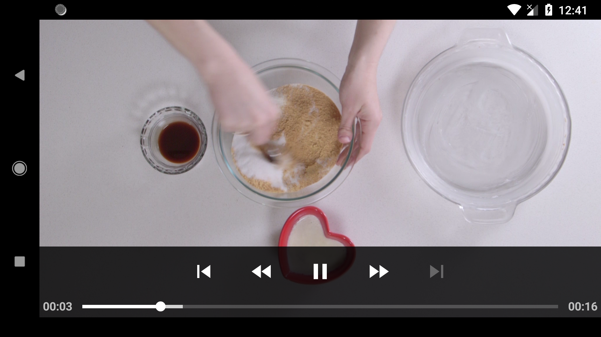
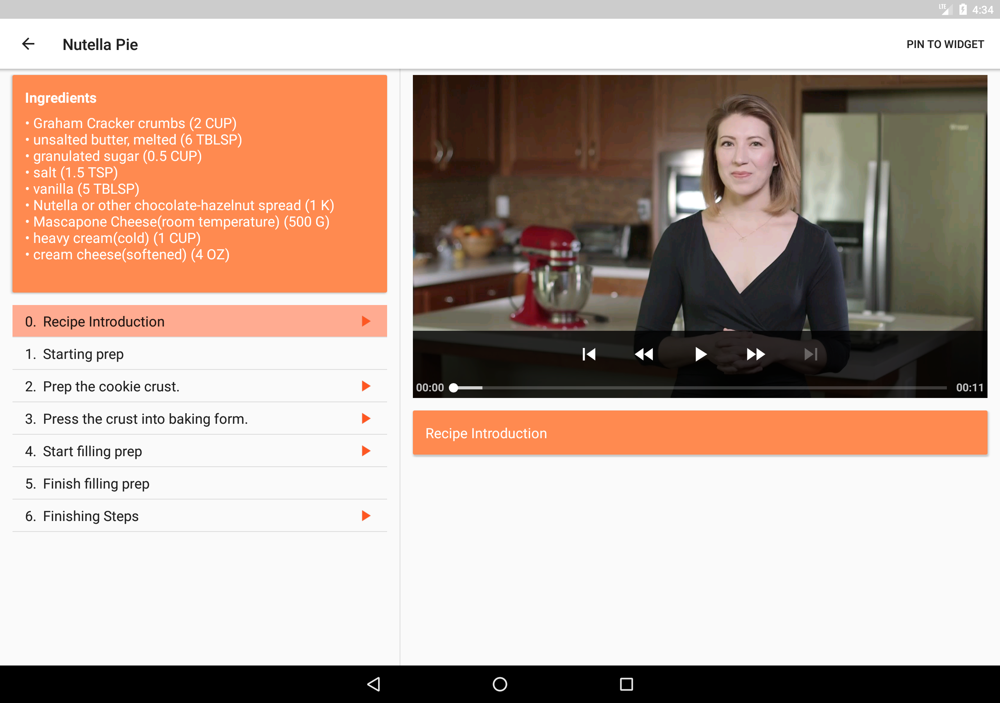

# Baking App
An app that allows a user to select a recipe and see video-guided steps for how to complete it.  
Third project in Udacity's [Android Developer Nanodegree][1].

## Download
You can download the app APK from [here][2].

## Screenshots
   
   
  
  

[1]: https://eg.udacity.com/course/android-developer-nanodegree-by-google--nd801
[2]: https://github.com/Abdallah-Abdelazim/Baking-App/releases/latest
